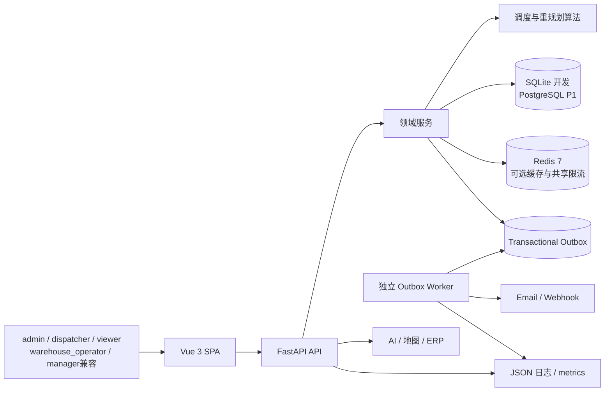
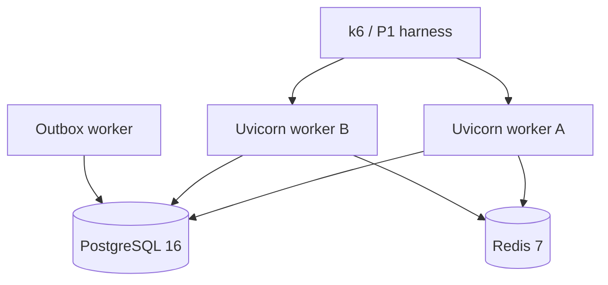
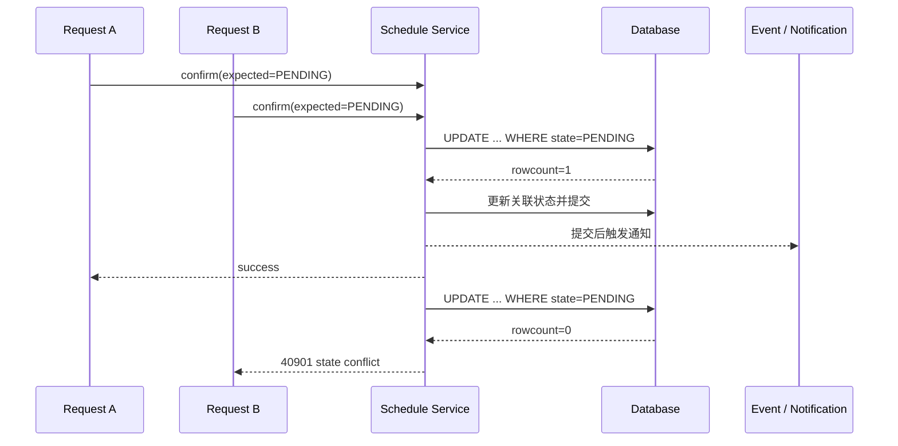
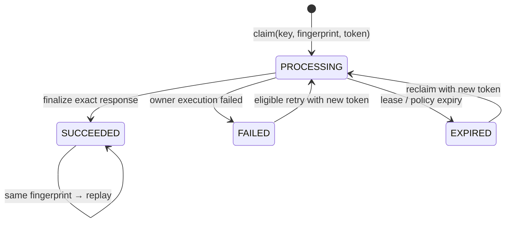
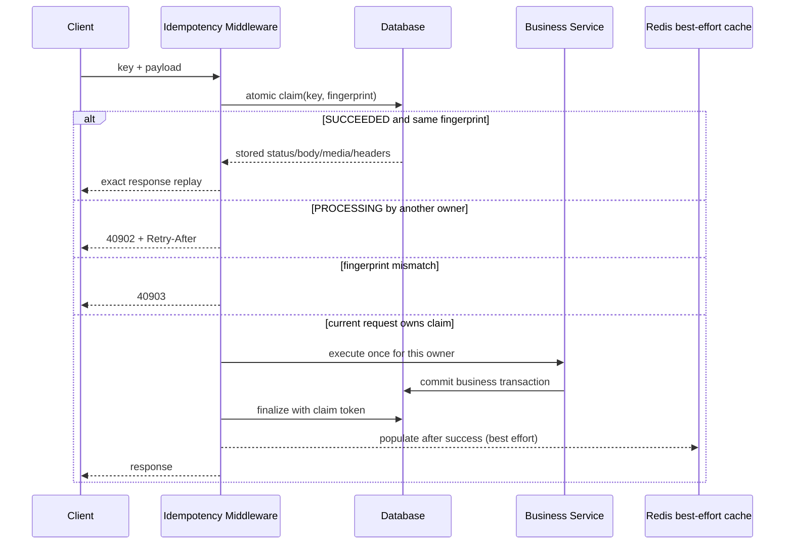
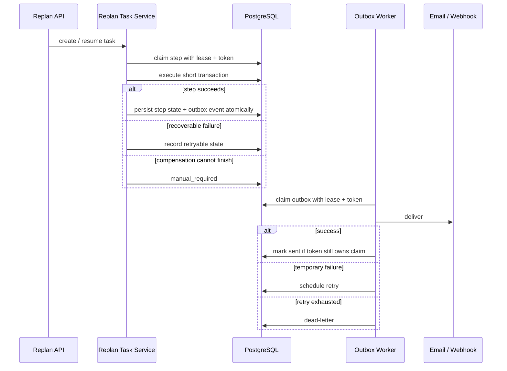
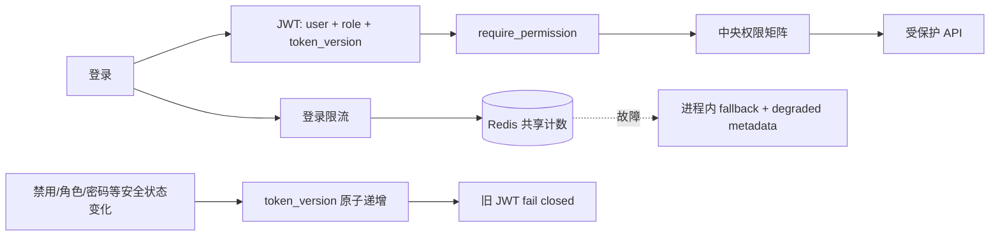
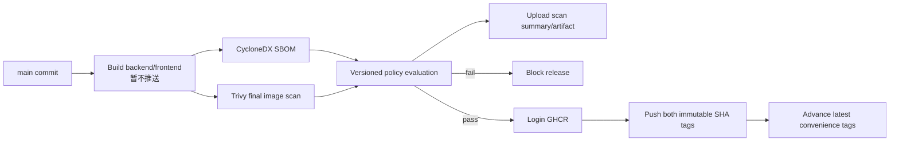

# 架构与核心流程

> 这份材料解释“系统如何工作、为什么这样设计、证据能支持到哪里”。数字统一引用 [Claim-to-evidence 台账](02-claim-evidence-ledger.md)。

## 1. 系统上下文



### 分层职责

| 层 | 责任 | 关键约束 |
|---|---|---|
| Vue SPA | 页面、权限显隐、领域 API、独立 Mock | 前端 `can()` 只改善体验，后端依赖注入才是授权边界 |
| FastAPI | HTTP 契约、鉴权、ID 传播、输入输出 | 对外错误统一为 `{code,message,data,meta}`；敏感异常不回显 |
| Services | 事务、状态机、幂等、Saga/outbox | API 只编排，不把一致性规则散落到路由 |
| Algorithms | 调度候选、评分、重规划策略 | 算法输出先形成建议，确认后才生效 |
| PostgreSQL | 正确性状态、CAS、幂等、编号、outbox | Redis 不承担核心正确性 |
| Redis | cache-aside、共享登录限流 | 故障时可见降级；fallback 不保持跨 worker 强一致 |
| Worker | outbox claim、发送、retry/dead-letter | 独立 Session；lease 与 token 防止旧执行者覆盖新结果 |
| CI/CD | 协议、故障、负载、安全门禁 | GHA 是生产近似验证环境，不是生产部署 |

## 2. P1 验证拓扑



该拓扑用于验证：

- PostgreSQL migration 与 P0 协议复跑；
- 两个可独立寻址的 HTTP worker；
- Redis 共享计数、pause 降级和恢复；
- worker restart replay、outbox lease reclaim 和 stale-token fencing；
- deadlock/serialization 有限重试、pool timeout、短暂断连、备份恢复；
- 分场景 load、spike、write、confirm 和 soak。

**边界**：GitHub Actions service container 不等于云主机或生产环境；没有据此承诺生产 SLA、RTO 或 RPO。

## 3. CAS：先抢占，后副作用



### 为什么不能先读再写

`SELECT state` 后在应用层判断会留下 TOCTOU 窗口：两个请求都可能读到 `PENDING`，随后重复更新、生成事件或通知。条件更新把“检查与占有”合成一个数据库动作；只有 `rowcount=1` 的请求有资格执行后续副作用。

### 为什么通知放到事务外

网络调用不能长期占用数据库锁。核心状态先在短事务内提交，再发送通知；通知失败由 outbox 恢复，而不是回滚已经正确提交的领域状态。

**证据**：SQLite 独立 Session 的 20/100 contender 场景最多一个成功且无重复副作用。该结果证明协议，不直接代表 PostgreSQL 生产吞吐。

## 4. 持久化幂等：claim → execute → finalize/replay





### 关键取舍

- **数据库承担正确性**：不同进程/worker 可以看到同一幂等记录；Redis 中断不会失去正确性状态。
- **fingerprint 防误重放**：同一 key 携带不同 payload 明确冲突。
- **token 防旧 owner 覆盖**：claim 被回收后，旧执行者不能 finalize 新 owner 的记录。
- **exact replay**：保存 HTTP status、response bytes、media type 和安全 headers，而不是重新执行业务。
- **编号独立原子化**：`code_ranges` 条件更新替代 `max+1`，避免跨 worker 冲突。

**边界**：业务事务提交到幂等记录 finalize 之间仍存在崩溃窗口，因此准确说法是“持久化幂等与恢复协议”，而不是 exactly-once。

## 5. Replan Saga + transactional outbox



### 恢复语义

1. Saga 任务和步骤状态持久化，进程重启后不是从内存猜测进度。
2. 每次 claim 带 lease 和 token；lease 到期可由新 worker 回收。
3. stale-token fencing 拒绝旧 worker 的迟到写入。
4. 业务变化与 outbox event 在同一数据库事务提交，避免“业务成功但消息没入队”。
5. outbox worker 使用独立、短生命周期 Session，失败进入 retry/dead-letter。
6. compensation 无法自动完成时进入 `manual_required`，不伪装为成功。

**边界**：outbox 能保证内部事件持久化和至少一次尝试；若外部邮件/Webhook 服务不支持幂等键，外部接收仍可能重复。

## 6. 鉴权、撤权与 Redis 降级



- 未知角色不获得默认权限；
- 前端从 `/me` 获取权限集合并使用 `can()` 控制展示；
- 后端 `require_permission()` 才是强制授权；
- 安全状态变化递增 `token_version`，旧 token 与数据库版本不一致时拒绝；
- Redis 健康时两个 worker 共享登录失败计数；主体材料经 HMAC-SHA256 处理，Lua 原子更新窗口；故障时显式降级，恢复探测成功后重新共享。

**边界**：Redis pause 期间每个进程各自 fallback，不承诺全局统一窗口；timeout/recovery 只保证服务可继续和恢复探测，不把降级状态说成跨 worker 强一致。

## 7. 可观测性链路

```mermaid
flowchart LR
    Req[HTTP request_id / trace_id] --> API[API JSON log]
    API --> SQL[SQL comment request_id]
    API --> Event[Outbox payload _trace]
    Event --> Worker[Worker new request_id\nsame trace_id\nparent_request_id]
    API --> Metrics[/metrics counters]
    Worker --> Metrics
```

失败请求可以用 request ID 定位单次执行，用 trace ID 关联 API 与异步 worker，用 task ID 定位重规划任务。敏感字段、SQL/DSN、Token、cookie、private key 和第三方 raw response 不进入公开响应。

该实现是应用级 trace propagation 与日志关联；没有声称已部署完整 OpenTelemetry Collector、Prometheus、Grafana 或跨 worker 指标聚合。

## 8. 安全发布链路



### 门禁规则和整改过程

- CRITICAL/HIGH 阻断；MEDIUM/LOW report-only；UNKNOWN、scanner error 和 missing report fail closed。
- 初始 backend/frontend 的阻断来自基础镜像 OS 包；先固化证据，再升级/切换基础层，没有放宽 policy。
- backend 的 Debian trixie 包处于 no-dsa/postponed，重复 `apt upgrade` 无法获得不存在的 fixed package，因此切换到 forky；frontend 切换到 Alpine 3.24。
- CD `33826520856` 最终零 exception 通过：backend 仅 1 个 MEDIUM report-only，frontend 无漏洞，然后才推送同一 SHA 批次。

### 审计边界

- 镜像批次固定为 `f9e08a499ba50987505e32d58b545a37c9543ef4`；
- `latest` 会随后续文档 commit 重建推进，不用于审计或回滚；
- 发布时门禁不等于定时扫描，也不等于镜像已在生产 Compose 中启动。

## 9. 面试回答框架

面对任何架构追问，按以下顺序回答：

1. **原始失败模式**：race、TOCTOU、dual write、stale worker、cache outage 或 vulnerable base image；
2. **不变量**：最多一个状态赢家、相同请求可重放、业务与 outbox 同事务、旧 token 不能覆盖新 claim、门禁失败不能发布；
3. **实现机制**：CAS/state machine/lease/token/fail-closed policy；
4. **验证场景**：环境、并发/时长、具体结果；
5. **剩余边界**：不使用 exactly-once、production-grade、永久无泄漏等超出证据的词。
