# 项目实现报告

> **项目名称**：DeepSeek 路径优化 —— 智能物流平台  
> **项目性质**：华中科技大学软件学院 2026 年教学实训项目  
> **团队规模**：2 人（1 前端 + 1 后端）  
> **开发周期**：4 周（2026-06-09 至 2026-06-25）  
> **本文作者**：后端开发工程师

---

## 目录

- [一、实习内容分析](#一实习内容分析)
  - [1.1 项目背景与系统概览](#11-项目背景与系统概览)
    - [1.1.1 项目分工](#111-项目分工)
    - [1.1.2 项目开发方法：VibeCoding 模式](#112-项目开发方法vibecoding-模式)
    - [1.1.3 项目管理](#113-项目管理)
    - [1.1.4 项目开发阶段说明](#114-项目开发阶段说明)
  - [1.2 后端开发实现](#12-后端开发实现)
    - [1.2.1 技术栈与架构](#121-技术栈与架构)
    - [1.2.2 分层架构设计](#122-分层架构设计)
    - [1.2.3 数据库设计（15 张 MVP 表）](#123-数据库设计15-张-mvp-表)
    - [1.2.4 核心调度链路实现](#124-核心调度链路实现)
    - [1.2.5 状态机设计](#125-状态机设计)
    - [1.2.6 异常处理与重规划](#126-异常处理与重规划)
    - [1.2.7 DeepSeek AI 集成](#127-deepseek-ai-集成)
    - [1.2.8 测试体系](#128-测试体系)
  - [1.3 需求调研与文档撰写](#13-需求调研与文档撰写)
    - [1.3.1 需求调研流程](#131-需求调研流程)
    - [1.3.2 PRD 需求文档体系](#132-prd-需求文档体系)
    - [1.3.3 API 契约文档体系](#133-api-契约文档体系)
  - [1.4 前后端联调协作](#14-前后端联调协作)
    - [1.4.1 协作模式](#141-协作模式)
    - [1.4.2 联调流程与反馈机制](#142-联调流程与反馈机制)
- [二、专题内容分析](#二专题内容分析)
  - [2.1 后端架构设计深度剖析](#21-后端架构设计深度剖析)
    - [2.1.1 分层架构解耦设计](#211-分层架构解耦设计)
    - [2.1.2 双标识策略](#212-双标识策略)
    - [2.1.3 统一响应格式](#213-统一响应格式)
    - [2.1.4 版本链追溯机制](#214-版本链追溯机制)
    - [2.1.5 确定性算法设计](#215-确定性算法设计)
  - [2.2 需求调研方法论](#22-需求调研方法论)
    - [2.2.1 "契约先行"模式](#221-契约先行模式)
    - [2.2.2 P0/P1/P2 优先级分级](#222-p0p1p2-优先级分级)
    - [2.2.3 决策记录机制（Q1-Q15）](#223-决策记录机制q1-q15)
  - [2.3 关键技术难点与解决方案](#23-关键技术难点与解决方案)
    - [2.3.1 调度超时控制](#231-调度超时控制)
    - [2.3.2 状态流转一致性](#232-状态流转一致性)
    - [2.3.3 版本链与重规划](#233-版本链与重规划)
    - [2.3.4 DeepSeek 降级容错](#234-deepseek-降级容错)
    - [2.3.5 前后端契约一致性问题](#235-前后端契约一致性问题)
- [三、实习中的收获与体会](#三实习中的收获与体会)
  - [3.1 后端工程能力](#31-后端工程能力)
  - [3.2 需求分析能力](#32-需求分析能力)
  - [3.3 团队协作能力](#33-团队协作能力)
  - [3.4 技术视野拓展](#34-技术视野拓展)
- [四、对实习的改进意见](#四对实习的改进意见)
  - [4.1 开发流程优化建议](#41-开发流程优化建议)
  - [4.2 联调效率提升建议](#42-联调效率提升建议)
  - [4.3 需求调研改进建议](#43-需求调研改进建议)
- [附录](#附录)
  - [A. 技术栈速览](#a-技术栈速览)
  - [B. 开发规模统计](#b-开发规模统计)
  - [C. 阶段交付清单](#c-阶段交付清单)
  - [D. 核心 API 路径速查](#d-核心-api-路径速查)
  - [E. 15 张 MVP 表结构概览](#e-15-张-mvp-表结构概览)

---

## 一、实习内容分析

### 1.1 项目背景与系统概览

"DeepSeek 路径优化 —— 智能物流平台"是一个面向三级物流网络的智能调度演示系统。系统模拟"存储中心（L0）→ 一级分拣中心（L1）→ 零级分拣中心（L2）"的三级物流配送体系，核心业务闭环为：


系统具备以下能力：
- **全局调度**：基于规则评分 + 启发式算法，为每票货物规划 L0→L1→L2 的最优路径
- **节点间调度**：批量分配车辆与司机，串行执行 L0→L1 和 L1→L2 两阶段调度
- **路径规划**：基于 Haversine 公式 + 2-opt 局部搜索算法规划单车最优路径
- **异常处理**：支持道路异常、包裹异常、节点异常三类场景，提供重调度（redispatch）和重规划（reroute）两种处理方式
- **AI 助手**：集成 DeepSeek API，支持自然语言解析调度意图、方案解释与异常分析

项目采用 2 人团队协作开发，严格遵循"API 契约先行、前后端并行开发、阶段末联调通过"的协作模式，最终交付可演示的完整系统。

#### 1.1.1 项目分工

| 角色 | 负责人 | 核心职责 |
|------|--------|----------|
| **后端开发工程师** | 本文作者 | 后端架构设计、数据库设计、API 接口开发、算法实现、服务层业务逻辑、异常处理与重规划、AI 集成、单元测试编写、与 DeepSeek 联调 |
| **前端开发工程师** | 团队成员 | 前端架构设计、Vue 组件开发、Pinia 状态管理、路由与权限守卫、Axios 请求封装、Mock 数据设计、路线可视化组件、AI 助手面板、与后端联调 |

**后端核心交付**：
- 48 个 API 端点、18 个服务模块、4 个算法模块、15 张数据表
- 287+ 个单元测试，覆盖所有核心业务路径
- 20 份 API 契约文档、12 份阶段开发文档
- 完整的状态机机制、版本链追溯体系、DeepSeek 降级策略

**前端核心交付**：
- 41 个 Vue 组件、68 个 TypeScript 文件、14 个 API 模块
- 11 条前端路由、Pinia 认证 Store、完整 Mock 体系
- 调度工作台、路线可视化、AI 助手面板等交互界面
- 支持 Mock/Real 双模式切换，可离线演示

#### 1.1.2 项目开发方法：VibeCoding 模式

本项目采用 **VibeCoding** 开发方法，利用 AI 智能体辅助全流程开发。VibeCoding 是一种以自然语言沟通驱动、AI 智能体执行、人工审查把关的新型开发范式，核心流程如下：


**智能体体系**：

| 智能体 | 职责 | 应用场景 |
|--------|------|----------|
| **需求分析智能体** | 收集整理业务需求、创建功能清单、将用户需求转化为技术需求 | 每个阶段开始前，对模糊需求进行深度澄清，输出 PRD 与用户故事 |
| **架构设计智能体** | 定义系统边界、接口契约、数据模型、技术选型 | 项目初期设计 15 张 MVP 表结构、分层架构、统一响应格式 |
| **后端开发智能体** | 编写路由层、服务层、算法层代码及单元测试 | 每个阶段的 API 实现、算法编码、测试用例编写 |
| **前端开发智能体** | 编写 Vue 组件、TypeScript 逻辑、Mock 数据 | 页面组件开发、状态管理、路由配置 |

**工作流程**：

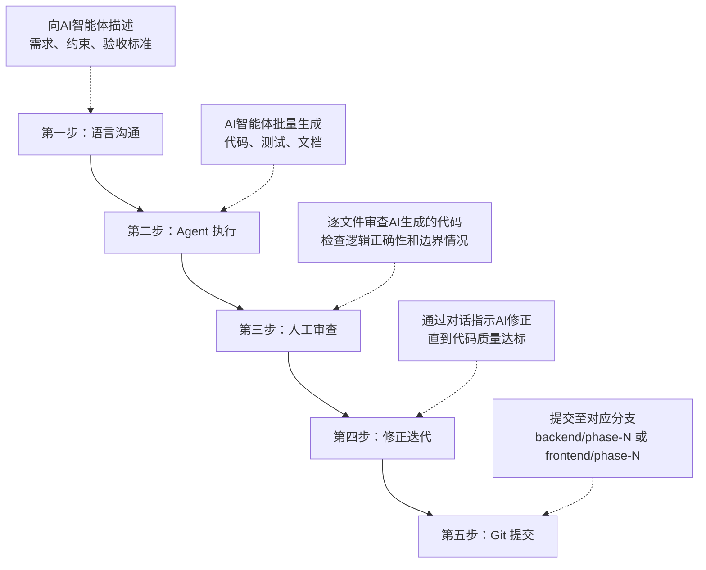

**VibeCoding 实践效果**：
- 代码生成效率大幅提升，常规 CRUD 接口和测试用例可批量生成
- 人工重心从"写代码"转移到"审代码"和"设计方案"
- 每次开发前必须有清晰的方案沟通，倒逼需求明确化
- AI 生成代码需通过单元测试验证，确保功能正确性

#### 1.1.3 项目管理

**Git 分支管理**：

项目严格遵循 Git 分支隔离策略：
- 后端使用 `backend/phase-N` 分支，前端使用 `frontend/phase-N` 分支
- 禁止直接在 `main` 分支上并行开发
- 每个阶段末通过 PR 合并至 `main`
- Commit 格式：`<type>(<scope>): <描述>`（如 `feat(backend): 阶段3 全局调度实现`）

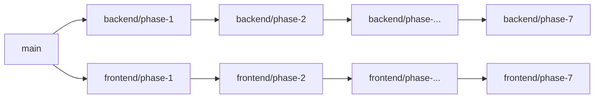

**文档管理**：
- `docs/` 目录存放正式文档（架构设计、PRD、API 契约、联调反馈等），需提交 Git
- `My_doc/` 目录存放阶段开发文档、辅助材料和临时文件，按 .gitignore 默认排除
- 共维护 87 份文档，涵盖需求 → 设计 → 开发 → 联调全流程

**阶段推进规则**：
- 9 个 MVP 阶段严格顺序依赖，每个阶段有明确的前置条件
- 阶段开始前：后端输出 API 契约 → 前端基于契约 Mock 并行开发
- 阶段结束条件：双方联调通过方可进入下一阶段
- P1 增强阶段在 MVP 全部完成后启动

**代码审查规则**：
- AI 生成的全部代码必须经过人工审查，不经审查不允许合并
- 所有服务层不直接写 `.status`，统一走 `transition_*_status()` 方法
- 重大架构决策（如方案 A / 方案 B 选择）需双方确认后执行

#### 1.1.4 项目开发阶段说明

项目整体分为 **MVP 版本**（8 个阶段，阶段 0-7）和 **P1 增强版本**（5 个子阶段，P1-1 至 P1-5）：

**MVP 版本 — 8 个阶段（后端全部参与）**：

| 阶段 | 名称 | 核心目标 | 后端 | 前端 |
|------|------|----------|:----:|:----:|
| 阶段 0 | 工程初始化 | 前后端项目可本地启动并联调 | ✓ | ✓ |
| 阶段 1 | 认证与权限 | 登录、JWT Token、RBAC 角色权限 | ✓ | ✓ |
| 阶段 2 | 基础数据管理 | 7 个实体 CRUD + 演示数据生成 | ✓ | ✓ |
| 阶段 3 | 全局调度 | F007 全局调度 + F021 打包 | ✓ | ✓ |
| 阶段 4 | 节点间调度 | F005 两阶段串行 + 批次管理 | ✓ | ✓ |
| 阶段 5 | 路径规划与可视化 | F006 路径规划 + SVG 路线图 | ✓ | ✓ |
| 阶段 6 | 模拟送达 | 模拟送达驱动状态流转 | ✓ | ✓ |
| 阶段 7 | 异常与重规划 | 异常记录 + 版本化重规划 | ✓ | ✓ |

> **阶段 3-4-5 为核心主链路**，优先保障完整性和稳定性。后续所有阶段（6、7、P1）依赖于核心链路完成。

**P1 增强版本 — 5 个子阶段（后端参与 4 个）**：

| 阶段 | 名称 | 核心目标 | 后端 | 前端 |
|------|------|----------|:----:|:----:|
| P1-1 | 调度展示优化 | 调度方案摘要卡片、包裹/任务明细展示 | — | ✓ |
| P1-2 | 全局调度增强 | 订单筛选、容量约束校验、重规划方案对比 | ✓ | ✓ |
| P1-3 | 节点到货确认 | 扫码确认包裹、异常上报、状态级联规则 | ✓ | ✓ |
| P1-4 | 前端 UI 增强 | 详情抽屉组件化、交互体验统一 | — | ✓ |
| P1-5 | AI 增强（选做） | 方案解释(F015)、审查(F016)、异常分析(F017) | ✓ | ✓ |

> P1-1 和 P1-4 为纯前端阶段，后端无需参与；其余 3 个子阶段（P1-2、P1-3、P1-5）后端参与开发。

**总计：13 个阶段（MVP 8 + P1 5），后端参与其中的 11 个阶段（MVP 8 + P1 3）。**

### 1.2 后端开发实现

#### 1.2.1 技术栈与架构

| 层级 | 技术选型 | 说明 |
|------|----------|------|
| Web 框架 | Python 3.11 + FastAPI 0.110+ | 异步 ASGI，自动生成 Swagger 文档 |
| ORM | SQLAlchemy 2.0+ | 声明式模型，Session 管理 |
| 数据库 | SQLite | 零配置，单文件部署 |
| 数据校验 | Pydantic v2 | 请求/响应模型校验 |
| 数据库迁移 | Alembic | 版本化数据库变更 |
| 认证 | PyJWT + passlib[bcrypt] | JWT Token 24h 过期，bcrypt 密码哈希 |
| AI 集成 | DeepSeek API (OpenAI 兼容) | httpx 异步调用 |
| 算法 | NumPy + 自研 Haversine + 自研 2-opt | 确定性算法，同输入可复现 |
| Excel | openpyxl + pandas | 订单批量导入 |
| 测试 | pytest + pytest-asyncio | 单元测试 + 集成测试 |

#### 1.2.2 分层架构设计

后端采用经典三层架构，严格遵循职责分离原则：

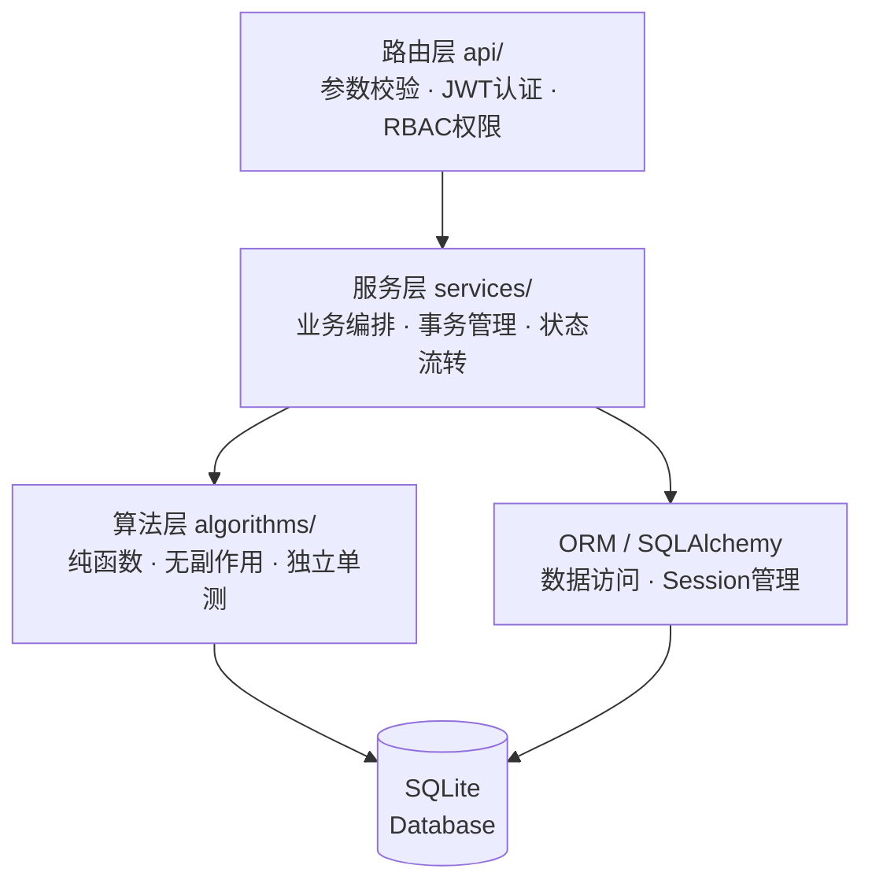

**路由层（api/）**：13 个路由文件，共 **48 个 API 端点**，按业务模块划分：

| 模块 | 文件 | 端点数 | 功能 |
|------|------|--------|------|
| 认证 | `auth.py` | 3 | 登录、获取用户信息、登出 |
| 订单 | `orders.py` | 6 | 订单 CRUD + 批量导入 |
| 货物 | `goods.py` | 3 | 货物列表、详情、编辑 |
| 包裹 | `packages.py` | 3 | 包裹列表、详情、重新打包 |
| 车辆 | `vehicles.py` | 5 | 车辆 CRUD |
| 司机 | `drivers.py` | 5 | 司机 CRUD |
| 节点 | `nodes.py` | 8 | 存储中心/分拣中心管理 |
| 调度 | `schedule.py` | 5 | 全局调度、节点调度、批次管理 |
| 路线 | `routes.py` | 5 | 路线列表、详情、坐标查询 |
| 异常 | `exception_events.py` | 5 | 异常 CRUD + 重规划触发 |
| 模拟 | `simulation.py` | 3 | 模拟送达、到货确认 |
| AI | `ai.py` | 4 | 智能解析、方案解释、审查、异常分析 |
| 健康 | `health.py` | 1 | 健康检查 |

**服务层（services/）**：18 个服务文件，核心服务包括：

| 服务 | 职责 |
|------|------|
| `schedule_service.py` | 全局调度编排（F007 + F021） |
| `dispatch_service.py` | 节点间调度（F005 两阶段串行） |
| `route_service.py` | 路径规划（F006） |
| `replan_service.py` | 异常重规划（版本链管理） |
| `exception_service.py` | 异常事件 CRUD |
| `state_machine.py` | 实体状态流转（订单/货物/包裹/车辆/司机/批次） |
| `deepseek_service.py` | DeepSeek API 调用与降级 |
| `simulation_service.py` | 模拟送达驱动状态流转 |
| `auth_service.py` | JWT 签发与验证 |

**算法层（algorithms/）**：4 个纯函数模块：

| 模块 | 算法 | 功能 |
|------|------|------|
| `global_schedule.py` | 规则评分 + 启发式搜索 | F007 全局调度，为货物规划 L0→L1→L2 路径 |
| `packaging.py` | 贪心合并 | F021 打包，按 from/to 节点对 + 同订单合并 |
| `node_dispatch.py` | 分配算法 | F005 车辆-司机-包裹分配 |
| `route_planning.py` | Haversine + 2-opt | F006 单车辆路径规划 |

#### 1.2.3 数据库设计（15 张 MVP 表）

系统共设计 15 张数据表，分为以下类别：

**系统表**（1 张）：
- `users` — 用户认证（预置 dispatcher/manager 账号，bcrypt 哈希密码）

**基础数据表**（7 张）：
- `nodes` — 节点统一建模（名称、经纬度、node_type）
- `storage_centers` — 存储中心特有属性（通过 node_id 关联）
- `sorting_centers` — 分拣中心特有属性（level: 0 级/1 级）
- `orders` — 订单
- `goods` — 货物
- `packages` — 包裹（含 goods_items JSON）
- `vehicles` — 车辆
- `drivers` — 司机

**调度结果表**（4 张）：
- `global_schedules` — 全局调度方案（含 goods_schedules JSON + 版本链字段）
- `dispatch_batches` — 调度批次（记录两阶段 F005 执行状态）
- `node_dispatches` — 单车调度明细（含 tasks JSON + level_phase 区分层级）
- `routes` — 路径规划结果（含 route_segments JSON）

**辅助表**（2 张）：
- `exception_events` — 异常事件记录
- `log_events` — 操作日志

**关键 JSON 字段设计**：
- `packages.goods_items`：`[{"goods_code": "G001", "order_code": "O001"}]`
- `node_dispatches.tasks`：`[{"from_node_code":"SC001", "to_node_code":"SO001", "package_codes":["PKG001"], "is_return":false}]`
- `routes.route_segments`：`[{"road_name":"虚拟大道", "start_lng":114.28, "start_lat":30.52, "end_lng":114.29, "end_lat":30.51}]`
- `global_schedules.goods_schedules`：`[{"goods_code":"G001", "order_code":"O001", "path":["SC001","SO001","SO027"]}]`

**双标识策略**：每张业务表同时拥有内部 `id`（BIGINT 自增主键，用于外键关联）和外部 `*_code` 业务编号（VARCHAR UNIQUE，暴露给 API），API 层绝不暴露数据库 `id`。

**实体关系图（ER Diagram）**：

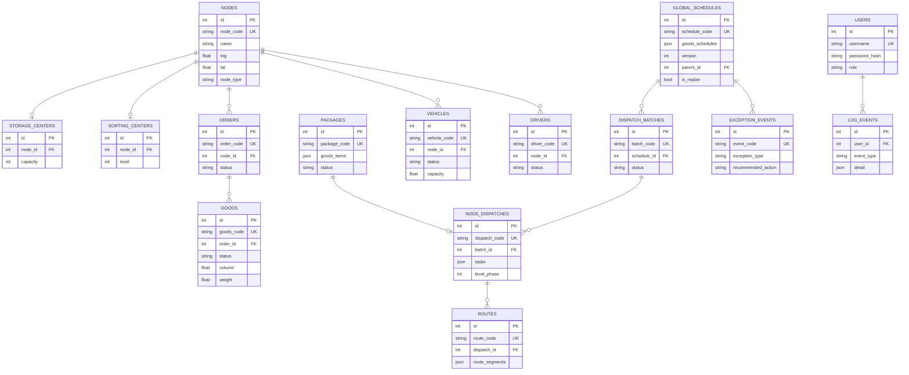

**版本链设计**：调度结果表（global_schedules、dispatch_batches、node_dispatches、routes）均包含 `version`、`parent_id`（自关联）、`replan_reason`、`is_replan` 字段，支持重规划时保留完整历史版本可比对。

#### 1.2.4 核心调度链路实现

核心调度链路是系统最关键的业务流程，串行依赖，严格按序执行：

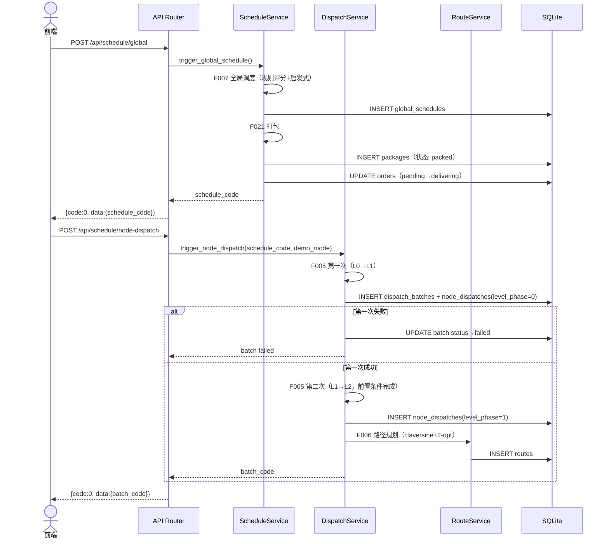

关键约束：
- F005 第一次失败则整个批次失败，不执行第二次。
- `demo_mode=true` 跳过 L1 实际送达等待，允许连续执行两次 F005（课堂演示用）。
- 模拟送达 API `POST /api/simulation/deliver` 驱动状态流转：L0→L1 送达后货物变"待打包"；L1→L2 送达后货物变"已送达"。
- 司机分配策略：从车辆归属节点选取 `status=idle` 的第一个司机，不做复杂排班。

**算法评分公式**（配置于 `algorithm_config.json`）：
- F007 全局调度：`score = w1×总距离 + w2×总时间 + w3×包裹数`（默认 w1=0.5, w2=0.3, w3=0.2）
- F005 节点间调度：同公式
- F006 路径规划：`cost = w1×距离 + w2×时间 + w3×碳排放`（默认 w1=0.4, w2=0.4, w3=0.2）

#### 1.2.5 状态机设计

系统实现了一套完整的状态机机制，确保实体状态流转的一致性和合法性。

**核心原则**：
- 所有服务层不直接写 `.status`，统一走 `transition_*_status()` 方法
- 非法转换立即抛出 `ValueError`，服务层捕获后返回统一错误响应
- 构造函数初始值不受限（创建实体时直接设初始状态）
- `force=True` 保留给数据修复/异常重规划等特殊场景

**实体状态流转规则**：

| 实体 | 状态流转路径 |
|------|-------------|
| 订单 | `pending` → `delivering`（F007 完成）→ `completed`（全部货物送达 L2）/ `exception` |
| 货物 | `pending_pack` → `packed`（节点打包）→ `in_transit`（F005 分配）→ `pending_pack`（到达 L1 需重新打包）/ `delivered`（到达 L2）→ `exception` |
| 包裹 | `pending_pack` → `packed` → `in_transit`（F005 分配）→ `delivered` → `exception` |
| 车辆 | `idle` → `delivering` → `idle`（模拟送达后回写）/ `maintenance` / `disabled` |
| 司机 | `idle` ↔ `busy` |
| 批次 | `pending` → `l0_l1_done`（第一次 F005 成功）→ `completed`（第二次 F005 + F006 成功）/ `failed` |

**核心状态机图**：

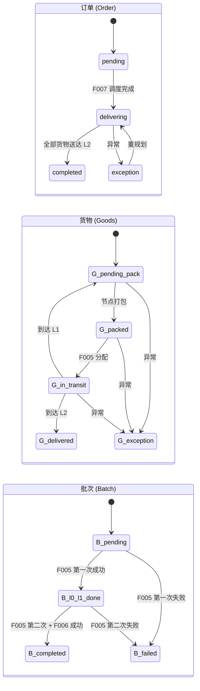

#### 1.2.6 异常处理与重规划

系统支持三类异常处理：

| 异常类型 | 处理方式 | 触发操作 |
|----------|----------|----------|
| 道路异常（road） | reroute | 仅重新执行 F006 路径规划 |
| 包裹异常（package） | reroute | 仅重新执行 F006 路径规划 |
| 节点异常（node） | redispatch | 重新执行 F007 + F005 + F006 |

**重规划实现方案**：采用方案 A —— 新建 `ReplanService`，不修改现有服务层。核心原则：
- 不修改 `schedule_service.py`、`dispatch_service.py`、`route_service.py`
- 版本链更新集中在 `replan_service.py` 中实现
- 重规划通过 `POST /api/exceptions/{event_code}/replan` 触发
- 生成新版本记录（version+1，parent_id 指向前一版本，is_replan=true）
- 原方案完整保留可对比

#### 1.2.7 DeepSeek AI 集成

`POST /api/ai/parse` 接口接收用户自然语言输入 → DeepSeek 解析为算法参数 JSON → 自动调用调度链路。

**降级策略**：若 DeepSeek API 调用失败（网络/配额/密钥问题），在统一响应中设置 `meta.degraded=true` 和 `meta.degraded_reason` 字段，使用默认算法参数完成调度。**绝不伪造 AI 成功结果**。

**其它 AI 接口**：
- `POST /api/ai/explain` — AI 方案解释（P1）
- `POST /api/ai/review` — AI 方案审查（P1）
- `POST /api/ai/analyze-exception` — AI 异常分析（P1）

#### 1.2.8 测试体系

| 类别 | 数量 | 说明 |
|------|------|------|
| 测试文件 | 54 个 | 覆盖所有服务层和算法层 |
| 单元测试 | 287+ | pytest + pytest-asyncio |
| 阶段 1 测试 | 8 | 认证与权限测试 |
| 阶段 2 测试 | 63 | 基础数据管理 CRUD 测试 |
| 阶段 3 测试 | 38 | 全局调度 + 打包测试 |
| 阶段 4 测试 | 45 | 节点间调度测试 |
| 阶段 5 测试 | 32 | 路径规划测试 |
| 阶段 6 测试 | 28 | 模拟送达测试 |
| 阶段 7 测试 | 19 | 异常与重规划测试 |
| 阶段 8 测试 | 22 | AI 助手与集成测试 |
| P1 增强测试 | 32 | P1 迭代新增测试 |

### 1.3 需求调研与文档撰写

#### 1.3.1 需求调研流程

本项目的需求调研遵循以下五步方法论：

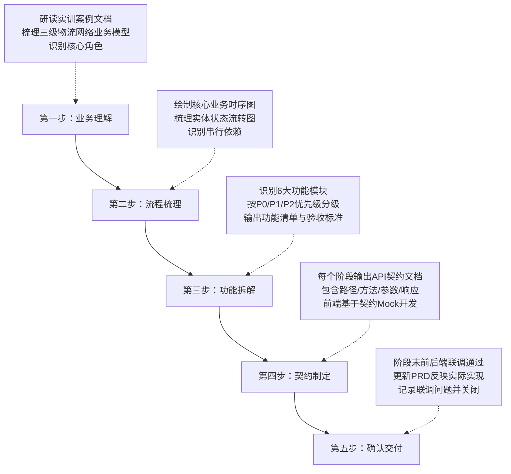

#### 1.3.2 PRD 需求文档体系

| 文档 | 版本 | 用途 |
|------|------|------|
| 产品需求文档(PRD) | V2.7 | MVP 基线版（108.57 KB），所有 P0 功能需求源 |
| 产品需求文档(PRD) | V2.8 | P1 交付版（9.53 KB），反映 P1 迭代后的需求变化 |

PRD 涵盖：功能需求描述、用户故事、业务流程、优先级定义、验收标准。

#### 1.3.3 API 契约文档体系

项目共输出 **20 份 API 契约文档**（docs 目录 14 份 + My_doc 目录 6 份），覆盖所有开发阶段：

| 阶段 | 契约文档 | 说明 |
|------|----------|------|
| 阶段 1 | api-contract-phase1.md | 认证与权限（login / me / logout） |
| 阶段 2 | api-contract-phase2.md | 基础数据管理（7 个实体 CRUD） |
| 阶段 3 | api-contract-phase3.md | 全局调度（F007 + F021） |
| 阶段 4 | api-contract-phase4.md | 节点间调度（F005 两阶段） |
| 阶段 5 | api-contract-phase5.md | 路径规划（F006） |
| 阶段 6 | api-contract-phase6.md | 模拟送达 |
| 阶段 7 | api-contract-phase7.md | 异常与重规划 |
| 阶段 8 | api-contract-phase8.md | AI 助手 |
| P1-1 至 P1-5 | 5 份 P1 契约 | P1 增强功能 |

每份契约文档包含：
- 路径、HTTP 方法、请求体/查询参数 Schema
- 成功/失败响应示例（含 `code`、`message`、`data`、`meta`）
- 错误码与业务规则说明
- 前后端约定的 Mock 数据结构

### 1.4 前后端联调协作

#### 1.4.1 协作模式

项目采用"契约先行、前后端并行"的协作模式：

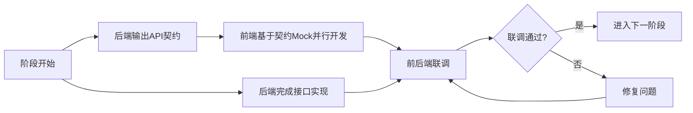

本人作为后端开发工程师，在联调中的核心职责包括：
- **契约输出**：每个阶段开始前，先编写 API 契约文档，定义接口路径、参数、响应格式和错误码
- **Swagger 维护**：利用 FastAPI 自动生成 Swagger 文档（`/docs`），前端可通过交互式文档直接测试接口
- **联调配合**：每次联调前确保所有接口通过单元测试，提供 `init_demo_data.py` 脚本生成演示数据
- **问题响应**：对前端提出的联调反馈问题快速定位和修复，保持反馈闭环
- **状态同步**：在调度链路联调中，特别注意状态流转的前置条件，提前告知前端正确调用顺序

#### 1.4.2 联调流程与反馈机制

共完成 **11 次**阶段联调（阶段 1-8 + P1-1 至 P1-3），每次联调流程如下：

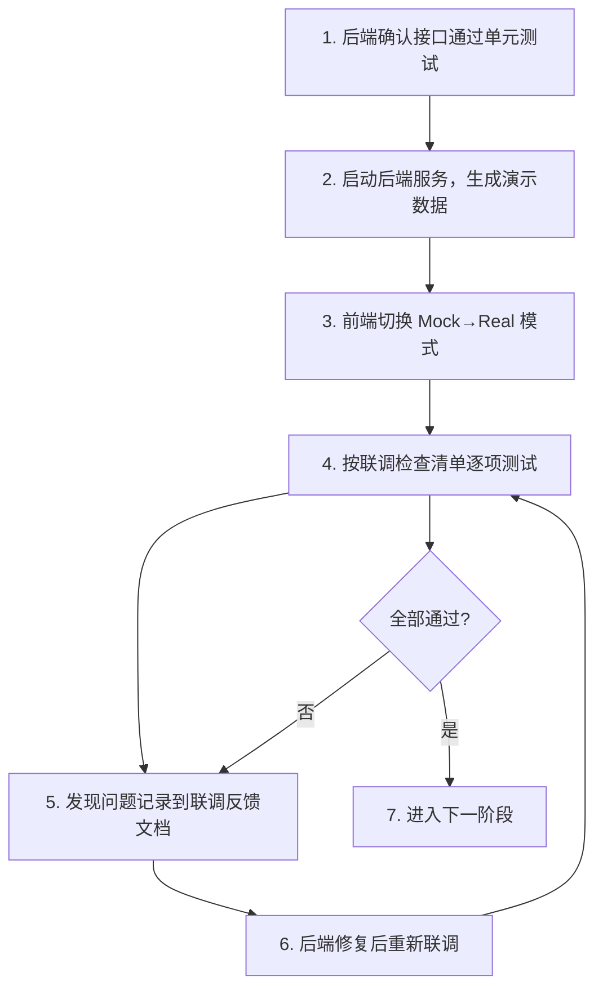

联调反馈文档共 **9 份**（docs/ 目录），每份包含：
- 接口测试结果（通过/失败/异常）
- 字段命名不一致问题（如 `schedule_code` vs `scheduleCode`）
- 响应格式与契约偏差
- 业务逻辑边界情况（如空列表处理、状态流转前置条件）
- 性能问题（如调度超时）

---

## 二、专题内容分析

### 2.1 后端架构设计深度剖析

#### 2.1.1 分层架构解耦设计

后端采用"路由层 → 服务层 → 算法/ORM"三层架构，每层职责明确、边界清晰：

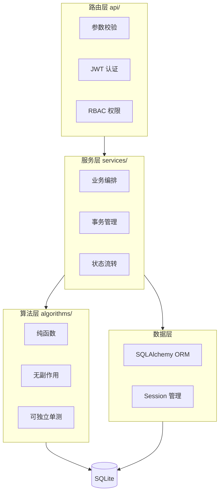

**解耦收益**：
- 算法模块为纯函数，**零依赖**于数据库和服务层，可独立进行单元测试和性能调优
- 服务层不直接操作 HTTP 请求对象，可通过依赖注入进行集成测试
- 路由层仅负责校验和分发，不包含业务逻辑，便于更换 Web 框架
- 重规划模块（ReplanService）通过调用现有服务层方法实现复用，**无需修改 ScheduleService / DispatchService / RouteService**，体现了良好的开闭原则

#### 2.1.2 双标识策略

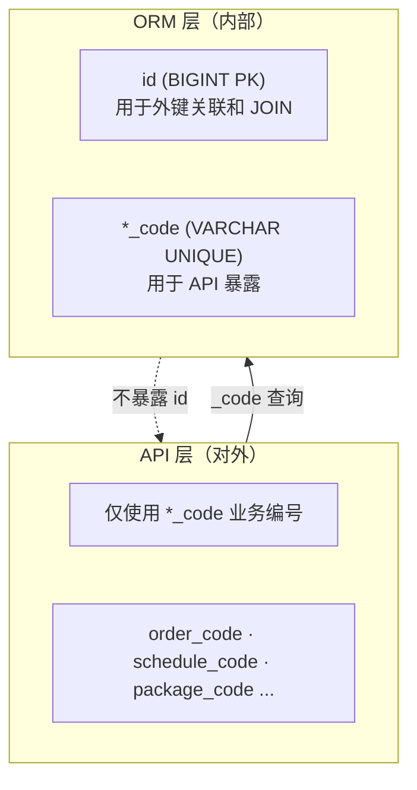

**设计意图**：
- **安全性**：数据库自增 id 不暴露给外部，避免枚举攻击
- **业务语义**：`GS20260609001` 比 `1234` 更具业务可读性
- **数据库性能**：自增 BIGINT 做外键关联比 VARCHAR 更高效
- **变更灵活性**：业务编号格式可独立调整，不影响数据库结构

#### 2.1.3 统一响应格式

所有 API 接口严格遵循统一的 JSON 响应格式：

```json
{
  "code": 0,
  "message": "success",
  "data": { },
  "meta": {
    "degraded": false,
    "degraded_reason": null
  }
}
```

**错误码体系**：

| 场景 | HTTP 状态码 | code | 说明 |
|------|------------|------|------|
| 成功 | 200 | 0 | 正常返回 |
| 业务失败 | 200 | ≠0 | 约束不满足等业务逻辑错误 |
| 参数错误 | 400 | 40000 | 字段校验失败 |
| 未认证 | 401 | 40100 | Token 无效或缺失 |
| Token 过期 | 401 | 40101 | JWT 已过期 |
| 无权限 | 403 | 40300 | RBAC 拒绝 |
| 占位接口 | 501 | 50100 | P1 预留功能 |

**设计收益**：
- 前端统一处理：先检查 `code` 再取 `data`，`meta.degraded` 控制降级提示
- 业务错误与 HTTP 错误分离：前端不需要解析 HTTP 状态码判断业务逻辑
- AI 降级透明化：通过 `meta` 字段明确告知用户是否为 AI 真实结果

#### 2.1.4 版本链追溯机制

调度结果表采用版本链设计，支持重规划时保留完整历史：

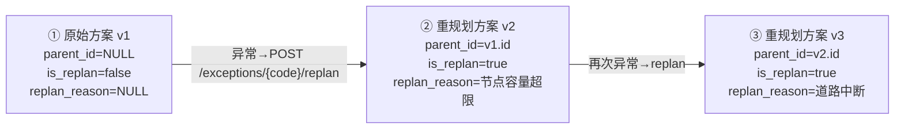

**设计意图**：
- **可审计**：每次调度变更都有完整追溯链
- **可对比**：新旧方案并存，可直接对比差异
- **可回滚**：理论上可回到任一历史版本
- **方案 A 实现**：版本链更新逻辑集中在 `ReplanService` 中，不侵入现有调度服务

#### 2.1.5 确定性算法设计

所有调度算法设计为**确定性算法**（不使用随机种子），确保：

- **同输入可复现**：相同订单数据 + 相同节点配置 → 相同调度结果
- **教学验收友好**：教师可使用相同数据复现学生演示结果
- **回归测试可靠**：测试用例结果固定，不会出现随机性导致的 flaky test

实现方式：
- 排序使用稳定排序（Python `sorted` 默认稳定）
- 2-opt 局部搜索使用确定性初始解（最近邻启发式）
- 算法配置权重从 `algorithm_config.json` 读取，不硬编码

### 2.2 需求调研方法论

#### 2.2.1 "契约先行"模式

本项目的核心需求管理方法是"API 契约先行"：


**契约文档包含**：
- 接口路径与方法
- 请求参数（Query / Path / Body）的完整 Schema
- 成功响应与各类失败响应的完整示例
- 业务规则与前置条件说明
- 错误码枚举

**实践效果**：
- 前端在阶段开始当天即可启动 Mock 开发，无需等待后端完成
- 联调时接口格式争议大幅减少（契约已有共识）
- 20 份契约文档构成完整的 API 知识库，新人可快速了解系统

#### 2.2.2 P0/P1/P2 优先级分级

基于 4 周时间约束，需求严格按优先级分级：

| 优先级 | 范围 | 策略 | 示例 |
|--------|------|------|------|
| P0 | MVP 核心功能 | **必须实现**，阶段 0-8 | 调度链路、基础数据 CRUD、路径可视化 |
| P1 | 增强功能 | **预留占位**（501），P1 选做实现 | AI 方案解释/审查、到货确认、Canvas 动画 |
| P2 | 运营分析 | **完全不实现** | 统计看板、报告导出 |

**分级决策原则**：
- 优先保障核心调度链路（阶段 3-4-5）的完整性和稳定性
- P1 功能仅在核心链路稳定后选择性实现
- P2 不进入 MVP 范围，避免 scope creep

#### 2.2.3 决策记录机制（Q1-Q15）

项目初期通过 15 项关键技术决策（Q1-Q15）明确了架构方向，决策涉及：

- **Q5**：统一响应格式设计
- **Q6**：DeepSeek 降级策略（不伪造 AI 结果）
- **Q7**：离线可演示（不依赖地图 API）
- **Q9**：确定性算法要求
- **Q12**：DeepSeek 失败返回降级标记而非错误
- **Q13**：节点统一建模（nodes + storage_centers + sorting_centers）
- **Q14**：打包策略（L0→L1 按节点对合并，L1→L2 按同订单合并）

这些决策记录在系统架构设计说明书中，成为后续开发不可违反的"宪法规则"。

### 2.3 关键技术难点与解决方案

#### 2.3.1 调度超时控制

**问题**：F007/F005/F006 要求在 **≤ 10 秒**内返回结果。随着订单和货物数量增长，搜索空间呈指数级增长。

**解决方案**：
- 算法设置迭代上限，超时返回当前最优解（非全局最优但可行）
- 前端 Axios timeout 设为 15s（留 5 秒缓冲）
- 调度接口按钮 `disabled + loading` 防重复点击
- 算法权重参数集中配置（`algorithm_config.json`），方便调优

#### 2.3.2 状态流转一致性

**问题**：核心调度链路涉及 6 类实体的状态流转，跨多个服务调用。任何环节状态不一致都会导致后续调度无法进行。

**解决方案**：
- 实现统一的 `state_machine.py`，所有服务层通过 `transition_*_status()` 修改状态
- 状态转换进行合法性校验，非法转换立即抛出 `ValueError`
- 调度链路使用事务包裹，确保原子性
- `force=True` 参数仅限异常重规划等特殊场景使用，防止误用

```python
# 示例：合法的状态转换
transition_order_status(order, "pending", "delivering")  # ✓
# 非法转换被拒绝
transition_order_status(order, "delivering", "pending")  # ✗ ValueError
```

#### 2.3.3 版本链与重规划

**问题**：异常重规划需要生成新版本调度方案，同时保留原方案可对比。版本链更新涉及 4 张调度结果表（global_schedules、dispatch_batches、node_dispatches、routes），需要保证一致性。

**解决方案**：
- 采用方案 A：新建 `ReplanService`，不修改现有服务层
- 版本链逻辑集中在 `ReplanService` 中
- 调用现有 Service 层方法生成新方案，然后设置 parent_id 建立版本链
- 所有调度结果表统一使用 `version`、`parent_id`、`replan_reason`、`is_replan` 字段

**方案 A 的优势**：
- 不侵入已有稳定代码（ScheduleService、DispatchService、RouteService 无需修改）
- 符合开闭原则：对扩展开放（新建 ReplanService），对修改关闭
- 版本链逻辑内聚，易于理解和测试

#### 2.3.4 DeepSeek 降级容错

**问题**：DeepSeek API 可能因网络、配额、密钥等原因调用失败，但调度功能不能因此中断。

**解决方案**：
- 在 `meta.degraded` 和 `meta.degraded_reason` 中明确告知用户
- 使用默认算法参数继续完成调度
- 响应 HTTP 200 + code=0（业务成功），而非返回错误
- 前端识别 `meta.degraded === true` 时展示 Warning 提示，不显示"AI 成功"

**原则**：绝不伪造 AI 成功结果。这是项目宪法规则之一，确保系统的可信度。

#### 2.3.5 前后端契约一致性问题

**问题**：前后端字段命名风格不一致（后端 Python `snake_case` vs 前端 TypeScript `camelCase`），联调时常出现字段名不匹配。

**解决方案**：
- FastAPI Pydantic 模型使用 `snake_case`，前端 Mock 数据也使用 `snake_case`
- Vite 代理转发 `/api` 到后端 8000 端口，保持路径一致
- 每次联调前，后端先通过 Swagger 验证接口可正常调用
- 联调反馈文档详细记录字段不一致问题，并统一修复

---

## 三、实习中的收获与体会

### 3.1 后端工程能力

通过本项目，我在后端开发方面获得了显著成长：

**完整项目周期的实践**：
- 从零搭建 FastAPI 项目，完整经历工程初始化 → 认证 → CRUD → 复杂业务链路 → 测试 → 联调的全流程
- 独立完成 48 个 API 端点、18 个服务模块、4 个算法模块、15 张数据表的设计与实现
- 编写 287+ 个单元测试，覆盖率覆盖所有核心业务路径

**架构设计思维**：
- 深刻理解分层架构的价值：算法层纯函数设计实现了独立测试和性能优化
- 掌握了"契约先行"的开发模式，接口设计先于实现
- 理解了双标识策略的安全性和灵活性权衡
- 实践了开闭原则：重规划模块通过新建 ReplanService 而非修改现有代码实现功能扩展

**状态机模式**：
- 在复杂业务系统中引入状态机模式，确保状态流转的一致性和可维护性
- 所有状态变更通过统一入口（`transition_*_status()`），杜绝"野状态"问题
- 理解了"force=True 仅限特殊场景"的设计约束必要性

**测试驱动思维**：
- 养成了"先写测试，再写实现"的习惯
- 测试不仅是验证手段，更是设计工具（测试驱动接口设计）
- 确定性算法 + 固定测试数据 = 可靠的回归测试体系

### 3.2 需求分析能力

**契约先行的实践**：
- 在开始编码前先输出 API 契约文档，这一习惯极大地减少了返工
- 学会从"前端需要什么"的角度定义接口，而非从"后端方便实现"的角度
- 20 份契约文档的编写，锻炼了技术文档的规范性和完整性

**优先级决策能力**：
- 在 4 周时间约束下，学会了如何做 P0/P1/P2 优先级决策
- 理解了"先做核心链路，再做增强功能"的迭代策略
- P0 核心功能（调度链路）投入约 70% 的时间，确保了演示可用性

**PRD 到技术方案的转化**：
- 学会了如何将 PRD 中的业务需求转化为技术方案
- 能识别 PRD 中隐含的非功能需求（性能、安全性、可复现性）
- 理解了 Q1-Q15 决策记录对团队共识的价值

### 3.3 团队协作能力

**前后端契约协作**：
- 通过 11 次阶段联调，深入理解了前后端协作的挑战和最佳实践
- 学会了在联调前提供演示数据脚本，让前端能快速验证
- 联调反馈文档的撰写，提升了跨角色技术沟通的清晰度

**文档驱动协作**：
- 开发文档、API 契约、联调反馈三类文档形成了完整的团队沟通体系
- 总计 87 份文档（docs 45 + My_doc 42），确保每个决策都有记录可查
- 文档不仅是交付物，更是团队知识的沉淀

**时间管理**：
- 4 周 9 阶段 5 子阶段的高强度开发，锻炼了时间规划和节奏控制
- 每个阶段有明确的前置条件、开发任务、联调节点、验收标准
- 学会了在"完美"和"交付"之间做权衡

### 3.4 技术视野拓展

- **FastAPI 生态**：深入掌握了 FastAPI 的依赖注入、中间件、异常处理、自动文档生成等特性
- **SQLAlchemy 2.0**：实践了声明式模型、Session 管理、Alembic 迁移、JSON 字段存储
- **算法实现**：自研 Haversine 公式 + 2-opt 局部搜索，理解了地理计算和组合优化的基础
- **AI 集成**：学习了 OpenAI 兼容 API 的调用方式，设计了降级容错策略
- **状态机设计**：在实战中应用状态机模式，理解了其在复杂业务流程中的价值

---

## 四、对实习的改进意见

### 4.1 开发流程优化建议

**1. 引入 CI/CD 自动化**

当前项目依赖手动执行测试和手动启动服务。建议：
- 配置 GitHub Actions，每次 Push 自动运行单元测试
- 联调前通过 CI 流水线自动部署到测试环境
- 测试失败时自动通知开发者

**2. 数据库迁移规范化**

当前 Alembic 迁移脚本为手动编写，存在遗漏风险。建议：
- 将迁移脚本纳入 Code Review 范围
- 在 CI 中增加迁移脚本的自动化测试（正向迁移 + 回滚验证）
- 建立迁移脚本命名规范（如 `YYYYMMDD_描述.py`）

**3. 结构化日志**

当前日志主要为 `print` 和 Python `logging` 基础用法。建议：
- 引入结构化日志（如 `structlog`），便于日志检索和分析
- 统一日志级别规范（DEBUG 开发调试、INFO 业务操作、WARNING 降级、ERROR 异常）
- 关键业务操作（调度、异常处理）记录审计日志

### 4.2 联调效率提升建议

**1. Mock Server 独立部署**

当前前端 Mock 数据直接编码在 API 模块中，与业务逻辑耦合。建议：
- 使用 Mockoon 或 Prism 搭建独立的 Mock Server
- Mock Server 从 API 契约文档（OpenAPI Spec）自动生成 Mock 数据
- 前端无需维护 Mock 逻辑，只需切换 Base URL

**2. 接口变更通知机制**

当前接口变更通过口头或文档通知，存在遗漏风险。建议：
- 在 CI 中集成 OpenAPI Diff 工具，自动检测接口变更
- 变更时自动生成 Changelog 并通知前端开发者
- 在 PR 描述中标注接口变更项

**3. Docker 标准化环境**

当前环境依赖手动安装 Python 依赖和 Node.js 包。建议：
- 编写 `docker-compose.yml`，一键启动前后端 + 数据库
- 确保所有开发者使用相同的 Python/Node 版本
- 联调环境与生产环境一致，减少"我机器上能跑"的问题

### 4.3 需求调研改进建议

**1. 用户故事映射**

当前需求以功能模块划分，缺乏对用户使用场景的系统梳理。建议：
- 引入用户故事映射（User Story Mapping），以用户旅程为主线组织需求
- 每个用户故事包含：作为 \<角色\>，我想要 \<功能\>，以便 \<价值\>
- 强化"为什么做"（YAGNI 检查）和"能更简单吗"（KISS 检查）的决策环节

**2. 需求变更影响评估**

当前需求变更主要靠口头沟通，缺乏系统性评估。建议：
- 重大需求变更填写变更评估表（影响范围、工作量、风险）
- 变更评审纳入前后端双方确认
- 涉及接口变更的需求先更新契约文档再编码

**3. 原型快速验证**

当前 API 契约以纯文档形式存在，前端无法在编码前体验交互。建议：
- 在阶段开始前，使用 Swagger UI 作为可交互的 API 原型
- 复杂业务流程（如调度链路）先用 Postman Collection 演示调用顺序
- 前端可在编码前通过 Swagger 直接发送请求，验证接口设计的合理性

---

## 附录

### A. 技术栈速览

| 层级 | 技术 | 版本 |
|------|------|------|
| 前端框架 | Vue | 3.5+ |
| 前端语言 | TypeScript | 5.x |
| 构建工具 | Vite | 5.x |
| UI 组件库 | Element Plus | 2.x |
| 状态管理 | Pinia | 2.x |
| HTTP 客户端 | Axios | 1.x |
| 后端框架 | FastAPI | 0.110+ |
| 后端语言 | Python | 3.11 |
| ORM | SQLAlchemy | 2.0+ |
| 数据库 | SQLite | 3.x |
| 认证 | PyJWT + passlib[bcrypt] | - |
| AI | DeepSeek API (OpenAI 兼容) | - |
| 算法 | NumPy + 自研 Haversine + 2-opt | - |
| 测试 | pytest + pytest-asyncio | - |

### B. 开发规模统计

| 指标 | 数值 |
|------|------|
| 开发周期 | 4 周（2026-06-09 至 2026-06-25） |
| 开发阶段 | 9 个 MVP 阶段 + 5 个 P1 子阶段 |
| 后端 API 端点 | 48 个 |
| 后端服务模块 | 18 个 |
| 后端算法模块 | 4 个 |
| 数据表 | 15 张 |
| 后端测试文件 | 54 个 |
| 后端测试用例 | 287+ 个 |
| 前端 Vue 文件 | 41 个 |
| 前端 TypeScript 文件 | 68 个 |
| 前端 API 模块 | 14 个 |
| API 契约文档 | 20 份 |
| 开发/架构/规范文档 | 87 份 |
| 总代码行数 | ~25,000+ 行 |

### C. 阶段交付清单

| 阶段 | 名称 | 核心交付 | 状态 |
|------|------|----------|------|
| 0 | 工程初始化 | 前后端项目可本地启动并联调 | 已完成 |
| 1 | 认证与权限 | 登录、JWT、RBAC 角色权限 | 已完成 |
| 2 | 基础数据管理 | 7 个实体 CRUD + 演示数据生成 | 已完成 |
| 3 | 全局调度 | F007 全局调度 + F021 打包 | 已完成 |
| 4 | 节点间调度 | F005 两阶段串行 + 批次管理 | 已完成 |
| 5 | 路径规划与可视化 | F006 路径规划 + SVG 路线图 | 已完成 |
| 6 | 模拟送达 | F013-1 状态流转驱动 | 已完成 |
| 7 | 异常与重规划 | F013 异常记录 + 版本化重规划 | 已完成 |
| 8 | AI 助手与收尾 | F014 DeepSeek + 埋点 + 验收打磨 | 已完成 |
| P1-1 | 调度展示优化 | 调度方案摘要、包裹/任务明细展示 | 已完成 |
| P1-2 | 全局调度增强 | 订单筛选、容量约束、重规划对比 | 已完成 |
| P1-3 | 节点到货确认 | 扫码确认、异常上报、状态级联 | 已完成 |
| P1-4 | 前端 UI 增强 | 详情抽屉组件化、统一交互体验 | 已完成 |
| P1-5 | AI 增强（选做） | 方案解释、审查、异常分析 | 已完成 |

### D. 核心 API 路径速查

| 模块 | 方法 | 路径 | 说明 |
|------|------|------|------|
| 认证 | POST | `/api/auth/login` | 用户登录 |
| 认证 | GET | `/api/auth/me` | 当前用户信息 |
| 订单 | GET/POST | `/api/orders` | 订单列表/新增 |
| 订单 | POST | `/api/orders/import` | 批量导入 |
| 货物 | GET | `/api/goods` | 货物列表 |
| 包裹 | GET | `/api/packages` | 包裹列表 |
| 车辆 | GET/POST | `/api/vehicles` | 车辆列表/新增 |
| 司机 | GET/POST | `/api/drivers` | 司机列表/新增 |
| 节点 | GET | `/api/nodes` | 节点列表 |
| 节点 | POST | `/api/nodes/storage-centers` | 新增存储中心 |
| 节点 | POST | `/api/nodes/sorting-centers` | 新增分拣中心 |
| 调度 | POST | `/api/schedule/global` | 触发全局调度 |
| 调度 | GET | `/api/schedule/global` | 历史方案列表 |
| 调度 | POST | `/api/schedule/node-dispatch` | 触发节点调度 |
| 调度 | GET | `/api/schedule/batches` | 批次列表 |
| 路线 | GET | `/api/routes` | 路线列表 |
| 路线 | GET | `/api/routes/by-vehicle/{code}/coordinates` | 车辆路线坐标 |
| 异常 | GET/POST | `/api/exceptions` | 异常列表/创建 |
| 异常 | POST | `/api/exceptions/{code}/replan` | 触发重规划 |
| 模拟 | POST | `/api/simulation/deliver` | 模拟送达 |
| AI | POST | `/api/ai/parse` | AI 智能解析 |
| AI | POST | `/api/ai/explain` | AI 方案解释 |
| 健康 | GET | `/api/health` | 健康检查 |

### E. 15 张 MVP 表结构概览

| 表名 | 分类 | 关键字段 | 说明 |
|------|------|----------|------|
| `users` | 系统 | username, password_hash, role | 预置 dispatcher/manager |
| `nodes` | 基础数据 | node_code, name, lng, lat, node_type | 节点统一建模 |
| `storage_centers` | 基础数据 | node_id (FK), capacity | 存储中心特有属性 |
| `sorting_centers` | 基础数据 | node_id (FK), level | 0 级/1 级分拣中心 |
| `orders` | 基础数据 | order_code, status | pending→delivering→completed/exception |
| `goods` | 基础数据 | goods_code, order_code (FK), status, volume, weight | 货物 |
| `packages` | 基础数据 | package_code, goods_items (JSON), status | 含货物清单 JSON |
| `vehicles` | 基础数据 | vehicle_code, node_code, status, capacity | idle→delivering→idle |
| `drivers` | 基础数据 | driver_code, node_code, status | idle↔busy |
| `global_schedules` | 调度结果 | schedule_code, goods_schedules (JSON), version, parent_id, is_replan | F007 输出 |
| `dispatch_batches` | 调度结果 | batch_code, schedule_code (FK), status | 批次聚合 |
| `node_dispatches` | 调度结果 | dispatch_code, tasks (JSON), level_phase | 0/1 层级 |
| `routes` | 调度结果 | route_code, route_segments (JSON), version, parent_id | F006 输出 |
| `exception_events` | 辅助 | event_code, exception_type, recommended_action, resolved_at | road/package/node |
| `log_events` | 辅助 | event_type, detail | 操作日志，30天清理 |

---

> **文档版本**：V1.0  
> **生成日期**：2026-06-29  
> **文档状态**：待审阅（修改后转为 Word 文档）

---

*本报告基于项目实际开发过程撰写，涵盖后端开发实现、需求调研、前后端联调、架构设计、技术难点与解决方案等内容。报告力求逻辑清晰、专业严谨，突出个人在后端开发中的核心贡献。*
