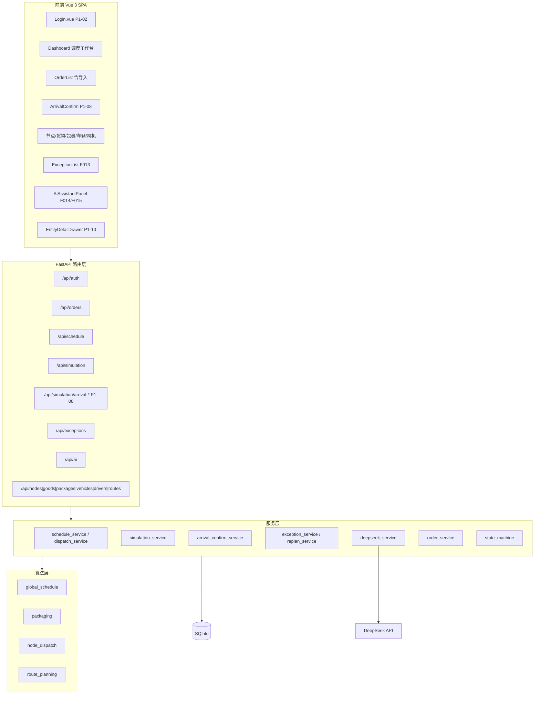

# DeepSeek 路径优化 - 智能物流平台 系统架构设计说明书（P1 交付版）

| 字段 | 值 |
| --- | --- |
| **项目名称** | DeepSeek 路径优化 - 智能物流平台 |
| **文档版本** | V1.1（P1 交付版） |
| **状态** | 已交付，与 `main` 实现一致 |
| **日期** | 2026-06-25 |
| **前置文档** | [系统架构设计说明书 V1.0（MVP）](./系统架构设计说明书.md) |
| **需求来源** | [PRD V2.8 P1 交付版](../prds/04产品需求文档(PRD)-V2.8-P1交付版.md) |
| **实现依据** | [P1开发计划.md](../P1开发计划.md) · [API 契约](../api-contract/) |

> **文档说明**：V1.0 为 MVP 立项时的架构基线（单体分层、15 张表、P1 扩展点预留）。  
> 本文档记录 **P1 迭代完成后的实际架构形态**，不重复 V1.0 全文；差异与增量以本章为准。

---

## 1. 架构总览（交付版）

### 1.1 架构形态（未变）

| 维度 | 交付版结论 |
| --- | --- |
| **部署形态** | 本地单体：FastAPI（:8000）+ Vue 3 SPA（:5173） |
| **数据存储** | SQLite `src/backend/data/logistics.db` |
| **通信** | REST + JSON；前端 Vite 代理 `/api` |
| **外部依赖** | DeepSeek API（F014 解析、F015 解释、F016/F017 后端已实现） |
| **未引入** | 微服务、消息队列、Redis、K8s、高德地图 API、PyTorch 推理 |

P1 迭代在 **同一单体架构** 内扩展模块与前端页面，未做服务拆分。

### 1.2 P1 架构增量一览

| 类别 | V1.0（MVP） | V1.1（P1 交付） |
| --- | --- | --- |
| 后端 API | 调度/模拟/异常/AI parse | + `arrival_confirm`；AI `explain/review/analyze-exception` **已实现** |
| 后端服务 | 编排 + DeepSeek 解析 | + `arrival_confirm_service`；`deepseek_service` 扩展 F015–F017 |
| 前端页面 | Dashboard + CRUD | + 到货确认页；登录/Layout 美化；详情抽屉体系 |
| 前端逻辑 | 调度 composables | + `useAiExplain`、`useArrivalConfirm`；Mock 环境开关 |
| 数据库 | 15 张表 | **无新增表**；P1-08 复用 packages/orders 状态机 |
| 权限 RBAC | 设计为 manager 只读 | **P1-12 未落地**，与 V1.0 设计有偏差 |

---

## 2. 逻辑架构（P1 交付版）



---

## 3. 后端分层与目录（实现映射）

```text
src/backend/
├── main.py                 # 路由注册（含 arrival_confirm、ai）
├── api/
│   ├── auth.py / orders.py / schedule.py / simulation.py
│   ├── arrival_confirm.py  # P1-08 到货确认
│   ├── ai.py               # F014 parse + F015 explain + F016/F017
│   └── exception_events.py / routes.py / ...
├── services/
│   ├── schedule_service.py / dispatch_service.py
│   ├── simulation_service.py
│   ├── arrival_confirm_service.py   # P1-08
│   ├── deepseek_service.py          # F014/F015/F016/F017
│   ├── order_service.py             # 含 import_orders
│   └── state_machine.py
├── algorithms/             # F007/F005/F006/F021（传统算法，无 ai/ 子目录）
├── models/                 # 15 张表 ORM（与 V1.0 §5.2 一致）
├── schemas/                # Pydantic（含 ai.py AiExplain*）
├── config/algorithm_config.json
├── data/logistics.db
└── scripts/init_demo_data.py
```

**V1.0 预留但未实现**：

- `algorithms/ai/`（F007-1/F005-1/F006-1）— 仍无
- `amap_service.py` — 仍无

---

## 4. 前端分层与目录（实现映射）

```text
src/frontend/src/
├── views/
│   ├── Dashboard.vue           # 调度主工作台 + AI 面板
│   ├── Login.vue               # P1-04 美化
│   ├── arrival/ArrivalConfirm.vue   # P1-08
│   └── orders|goods|packages|...
├── components/
│   ├── schedule/               # 路径表、地图 SVG、批次面板
│   ├── ai/                     # AiAssistantPanel、ExplainResultBody
│   ├── detail/                 # 各实体 DetailBody + EntityDetailDrawer
│   └── crud/                   # DataTable、PageToolbar
├── composables/
│   ├── useGlobalSchedule.ts / useNodeDispatch.ts
│   ├── useAiParse.ts / useAiExplain.ts      # F014/F015
│   ├── useArrivalConfirm.ts                 # P1-08
│   └── useSimulationDelivery.ts
├── api/                        # request.ts + 各领域 API
├── utils/env.ts                # VITE_USE_MOCK_* 开关
└── layouts/MainLayout.vue      # P1-04 侧栏布局
```

**Mock 策略**：开发期 `VITE_USE_MOCK_*` 分模块开关；答辩/联调时全关，走真实 API。

---

## 5. 接口层变更（相对 V1.0）

### 5.1 P1 新增或实质性实现的端点

| 模块 | 方法 | 路径 | 功能 | 状态 |
| --- | --- | --- | --- | --- |
| 到货确认 | GET | `/simulation/arrival-packages` | 待确认包裹列表 | ✅ P1-08 |
| 到货确认 | POST | `/simulation/confirm-arrival-batch` | 批量确认 normal/exception | ✅ P1-08 |
| 全局调度 | POST | `/schedule/global` | 支持 `preview` + `confirm` 两步 | ✅ P1-03 |
| AI | POST | `/ai/explain` | F015 方案解释 | ✅（V1.0 为 501 占位） |
| AI | POST | `/ai/review` | F016 方案审查 | ✅ 后端；前端占位 |
| AI | POST | `/ai/analyze-exception` | F017 异常分析 | ✅ 后端；前端占位 |

契约详见 [api-contract-p1-3.md](../api-contract/api-contract-p1-3.md)、[api-contract-p1-5.md](../api-contract/api-contract-p1-5.md) 等。

### 5.2 统一响应（延续 V1.0）

```json
{
  "code": 0,
  "message": "success",
  "data": { },
  "meta": { "degraded": false, "degraded_reason": null }
}
```

DeepSeek 降级时 `code=0` + `meta.degraded=true`（F014/F015 等）。

---

## 6. 数据库（交付版）

与 V1.0 **§5.2 MVP 表清单（15 张）** 一致，P1 未新增业务表。

| P1 能力 | 数据策略 |
| --- | --- |
| P1-03 预览方案 | `global_schedules.status` / draft 流程 |
| P1-08 到货确认 | 更新 `packages`、`goods`、`orders` 状态；触发 F021 重打包 |
| F015 解释 | 只读查询 `global_schedules` 详情，不写库 |

ER 与 DDL 仍以 V1.0 §5.3 为准。

---

## 7. V1.0 扩展点实现对照

| V1.0 §4.7 扩展点 | P1 交付结果 |
| --- | --- |
| DQN / MLP+LSTM | ❌ 未实现 |
| 高德地图 API | ❌ 未实现（仍为 SVG 路线） |
| `/api/ai/explain` 等 501 占位 | ✅ explain 已实现；review/analyze 后端已实现 |
| F009 方案对比 | ❌ 未实现 |
| F012 异常模拟 UI 增强 | ⚠️ 部分（到货确认页，无自动规则） |
| traffic_data / historical_data | ❌ 未建表 |
| F018–F020 运营统计 | ❌ 未实现 |
| Canvas 轨迹 F011 | ❌ 未实现 |

---

## 8. 安全与权限（交付版偏差）

| 项 | V1.0 设计 | 实际交付 |
| --- | --- | --- |
| JWT + bcrypt | ✅ | ✅ |
| manager 对写操作拒绝 | ✅ 设计 | ⚠️ P1-12 未严格实现 |
| DeepSeek Key 后端持有 | ✅ | ✅ |
| CORS localhost:5173 | ✅ | ✅ |

答辩可口头说明权限为已知裁剪项。

---

## 9. 部署与运行（交付版）

与 V1.0 一致，见 [环境配置说明.md](../环境配置说明.md)、[README.md](../../README.md)。

```bash
# 后端
cd src/backend && python -m scripts.init_demo_data
uvicorn main:app --reload --port 8000

# 前端（Mock 全关用于真实联调/答辩）
cd src/frontend && npm run dev
```

演示资源：根目录 [`orderdata.xlsx`](../../orderdata.xlsx) → `POST /api/orders/import`。

---

## 10. 架构评审（P1 交付结论）

| 维度 | V1.0 得分 | P1 交付说明 |
| --- | --- | --- |
| 需求覆盖度 | 92（MVP P0） | P1 必做 7 项 + F015 已覆盖；选做部分未做 |
| 架构简洁性 | 95 | 仍为单体，无过度设计 |
| 可实施性 | 90 | 两人团队已完整落地 |
| 可扩展性 | 85 | AI 模型/地图/运营统计仍为后续扩展点 |
| **综合** | **89.5 通过** | **P1 交付不触发架构重构；维持 V1.0 形态** |

---

## 11. 相关文档

| 文档 | 说明 |
| --- | --- |
| [系统架构设计说明书 V1.0](./系统架构设计说明书.md) | MVP 架构基线（ER、接口、评审全文） |
| [PRD V2.8](../prds/04产品需求文档(PRD)-V2.8-P1交付版.md) | 产品交付范围 |
| [API 契约目录](../api-contract/) | 各阶段接口规格 |
| [联调反馈](../联调反馈-P1-3-致后端.md) 等 | 前后端对齐记录 |

---

## 版本历史

| 版本 | 日期 | 修改内容 | 作者 |
| --- | --- | --- | --- |
| V1.1 | 2026-06-25 | P1 交付版：逻辑架构更新、模块/目录映射、扩展点对照、与 V1.0 差异 | 项目组 |
